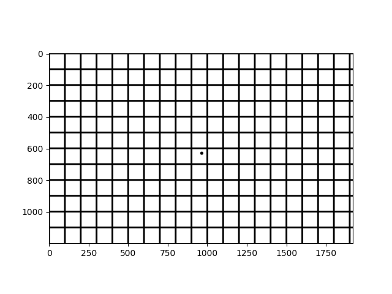
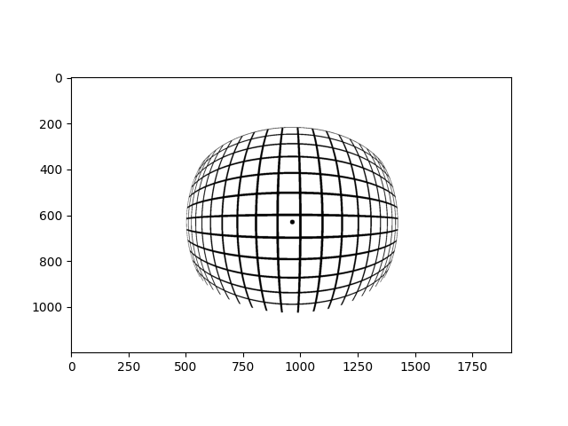

# Vilota Task 2

## Part 1: OpenImuCameraCalibrator (OICC) Tool For Camera Calibration

### Overview

Camera calibration is a process to determine the intrinsic and extrinsic parameters of a camera. The intrinsic parameters include the focal length, principal point, and lens distortion coefficients. The extrinsic parameters include the rotation and translation of the camera with respect to the world coordinate system. The calibration is done by taking multiple images of a calibration pattern with known geometry (usually chess board pattern) and using the images to estimate the parameters. To understand the basic ideas, I find this [YouTube playlist](https://www.youtube.com/playlist?list=PL2zRqk16wsdoCCLpou-dGo7QQNks1Ppzo) quite helpful.

Our goal is to set up the [`OpenImuCameraCalibrator`](https://github.com/urbste/OpenImuCameraCalibrator/tree/master) and run a calibration [example](https://github.com/urbste/OpenImuCameraCalibrator/blob/master/docs/gopro_calibration.md) given in the repository.

As the repository has a Dockerfile, initially I tried to build the Docker image and run the image on my local machine. But I faced some issues as some of the dependencies are not executable on my Mac M1 ARM architecture. So, I decided to create an x64 architecture Ubuntu 22.04 virtual machine on Azure with my Student subscription. To create a VM on Azure and connect to it using SSH, can refer to this documentation: [Quickstart: Create a Linux virtual machine in the Azure portal](https://learn.microsoft.com/en-us/azure/virtual-machines/linux/quick-create-portal?tabs=ubuntu).

With the clean VM, I followed the installation instructions given in the repository README. However, I find the instructions were quite lacking as some depedencies were not mentioned, so it is much better to just follow the Dockerfile to install everything.

Another issue I faced was certain part of the script will open a window to display the plot using `cv::imshow()` or `plt.show()`, which would not work without GUI. As I also want to save the plot for later reference instead of just viewing it, I modified the code in the repository accordingly using `cv:imwrite()` or `plt.savefig()` before building the OICC application.

The rest is just to download the GoPro9 dataset and run the Python script following the example given (it seems like the results are not fully deterministic as the results usually vary by a few decimal points per run). The various output plots and calibration results are saved in the `OICC-output` directory.

### Results

1. **Camera Model Used for Calibrating the Camera**: refer to `cam_calib_GH010162_di_2.0.json` for the values.

   - The camera model used is "DIVISION_UNDISTORTION", refer to this [paper](https://publikationen.bibliothek.kit.edu/1000140748) for more details.

2. **Camera Intrinsic Values**: refer to `cam_calib_GH010162_di_2.0.json` for the values.

   - **Focal Length**: 438.77649332978007 pixels
   - **Principal Point**: (480.7803392529939, 273.9111676692394) pixels
   - Other important values:
     - **Aspect Ratio**: 0.9975680908981368 (almost 1, so focal length is same in both x and y direction)
     - **Skew**: 0.0
     - **Distortion Coefficient (for the Division Undistortion model)**: -1.4205088968006023e-06

3. **Extrinsic between IMU and Camera (T_camera_to_imu)**: refer to `cam_imu_calib_result_GH010164.json` for the values, can be broken down into rotation and translation.

   - **Rotation from IMU to Camera** (Quaternion format):
     - **w**: 0.00036909468087599636
     - **x**: -0.0029542861106875975
     - **y**: -0.7090053081563532
     - **z**: 0.7051968583089459
   - **Translation from IMU to Camera**:
     - **x**: 0.00436223202935702
     - **y**: -0.029004819071142086
     - **z**: 0.004429337640346526

4. **Time Offset IMU to Camera**: refer to `cam_imu_calib_result_GH010164.json` for the values.

   - **Estimated Time Offset**: -0.012422480060567525 seconds

## Part 2: Analytical - Fisheye Camera Model

### Setup

Install the required packages using the following command:

```bash
pip install -r requirements.txt
```

### Idea

Fisheye lenses are wide-angle lenses that provide a broad hemispherical view. However, it can also introduce significant distortion, one of which is radial distortion where points with the same distance from the optical center have the same amount of distortion. But as long as we can model the distortion, we can easily correct it later.

One possible distortion model is KB4 that is applicable for not just fisheye lenses. Refer to this [paper](https://users.aalto.fi/~kannalj1/calibration/Kannala_Brandt_calibration.pdf) or the openCV documentation for [FishEye camera model](https://docs.opencv.org/4.x/db/d58/group__calib3d__fisheye.html) for more details. I personally find the openCV documentation much more straightforward to understand by following the given equations and its source code.

As all the camera instrinsic values (focal length and principal points) and distortion coefficients (k1 to k4) are already given, we can directly implement the Python code following the equations (the main step is to calculate the angle theta to transform the undistorted camera coordinates to the distorted camera coordinates).

Visualization of the distortion is done by distorting a normal grid image and plotting the distorted grid image. Pixel coordinates of the normal grid image are first converted back to the camera coordinates, then to the distorted camera coordinates using the fisheye distortion model, and finally back to the pixel coordinates of the distorted grid image. Refer to the `kb4_visualization.ipynb` for the implementation.

### Visualization

The distortion is classified as barrel distortion as the straight lines appear to be curved inwards.




